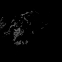
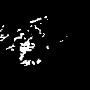
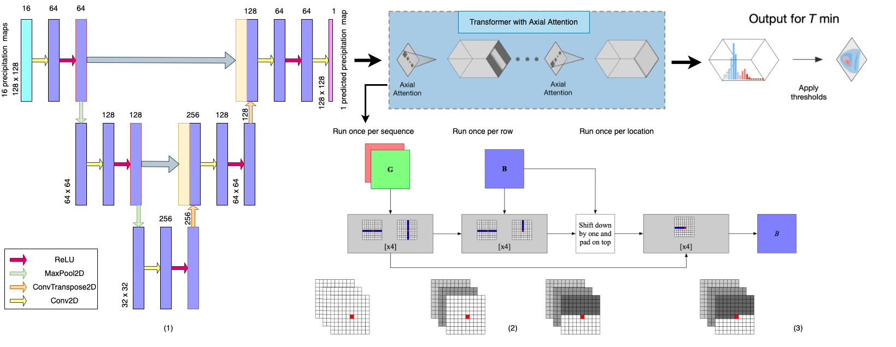

# UNet with Axial Transformer : A Neural Weather Model for Precipitation Nowcasting
### Contributors:
- Maitreya Sonawane (New York University, mss9240)
- Sumit Mamtani (New York University, sm9669)

Research Paper Link - https://drive.google.com/file/d/1v_WC_F7IisdKy8d-0te5UrvLwVBer86d/view?usp=sharing
Cleaned Dataset Link - https://drive.google.com/file/d/1y1neDWLtT8M3jELEQ-zk5i9eTjxJy2Wk/view?usp=sharing

The GitHub repository contains the code used in final project for Computer Vision - CSCI-GA.2271-001 (Fall 2021).

### Abstract:
Making accurate weather predictions can be particularly challenging for localized storms or events that evolve on hourly timescales, such as thunderstorms. Hence, our goal for the project was to model Weather Nowcasting for making highly localized and accurate predictions that apply to the immediate future replacing the current numerical weather models and data assimilation systems with Deep Learning approaches. A significant advantage of machine learning is that inference is computationally cheap given an already trained model, allowing forecasts that are nearly instantaneous and in the native high resolution of the input data. 

In this work we developed a novel method that employs Transformer-based machine learning models to forecast precipitation. This approach works by leveraging axial attention mechanisms to learn complex patterns and dynamics from time series frames. Moreover, it is a generic framework and can be applied to univariate and multivariate time series data, as well as time series embeddings data. This paper represents an initial research on the dataset used in the domain of next frame prediciton, and hence, we demonstrate state-of-the-art results in terms of metrices (PSNR = 47.67, SSIM = 0.9943) used for the given dataset using UNet with Axial Transformer.
The target (1) and predicted output (2) sequence of novel model is given below:

 
    

The architecture of our novel model is shown:

  
 
 ## Results
|                             | PSNR on test set | SSIM on test set |
|-------------------          |------------------|------------------|
| ConvLSTM                    | 40.8852            |       0.9710           |
| cGANs                       | 41.1319            |          0.9826        |
| UNets                       | 47.2862           |          0.9929        |
| UNet with axial transformer | 47.6678            |          0.9943        |
 
 
## Requirements
- 128GB RAM
- Pytorch 1.0
- Numpy + Rawpy
- Matplotlib
- GPU : Nvidia RTX1800

## References 

- [1] https://github.com/sladewinter/ConvLSTM
- [2] https://github.com/lucidrains/axial-attention
- [3] Xingjian Shi, Zhourong Chen, Hao Wang, Dit-Yan Yeung,Wai kin Wong, and Wang chun Woo. Convolutional lstm net-work:  A machine learning approach for precipitation now-casting, 2015.
- [4] Nitish Srivastava, Elman Mansimov, and Ruslan Salakhutdi-nov.   Unsupervised learning of video representations usinglstms, 2016.
- [6] Kevin Trebing, Tomasz Stanczyk, and Siamak Mehrkanoon.Smaat-unet:Precipitation   nowcasting   using   a   smallattention-unet architecture, 2021.
- [7] Casper  Kaae  Sønderby,  Lasse  Espeholt,  Jonathan  Heek,Mostafa  Dehghani,  Avital  Oliver,  Tim  Salimans,  ShreyaAgrawal, Jason Hickey, and Nal Kalchbrenner.   Metnet:  Aneural weather model for precipitation forecasting, 2020.
